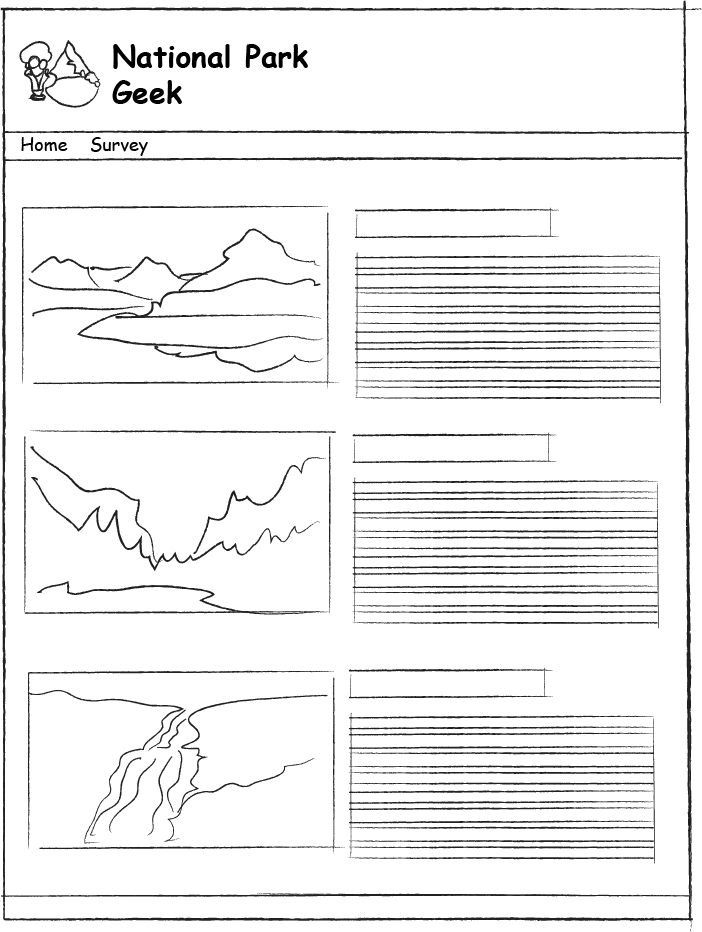
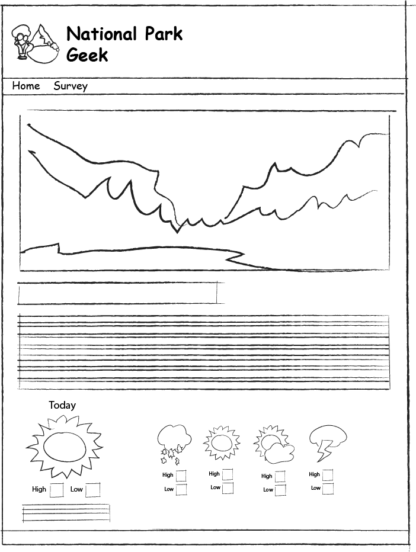
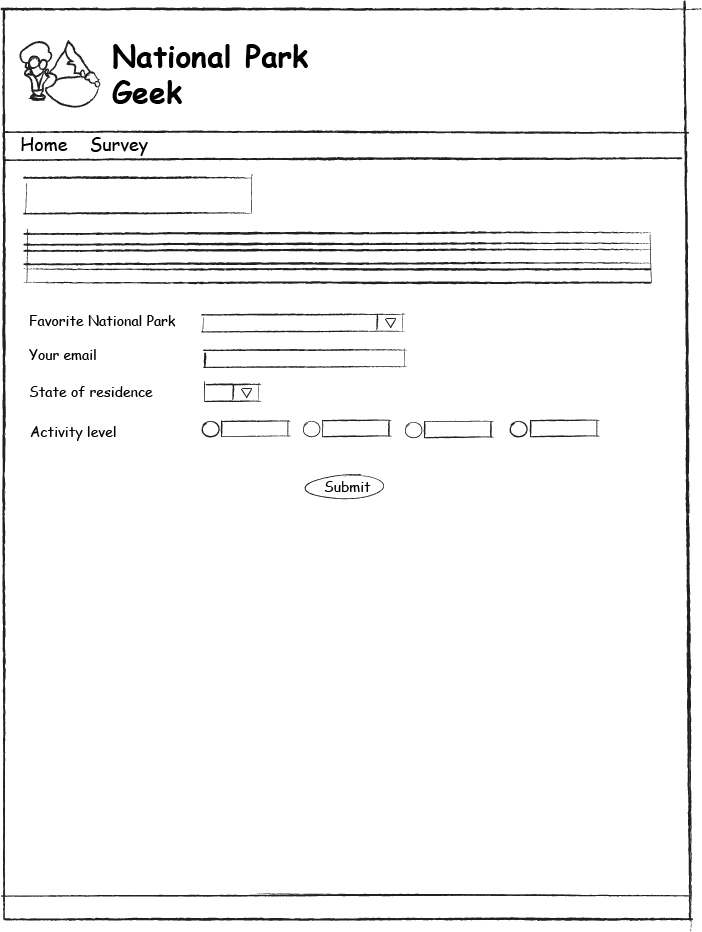
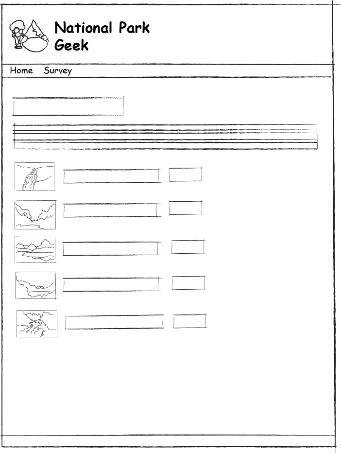

# National Park Geek

## Home Page

The home page is a simple alphabetical listing of all National Parks in the database. The displayed detail for each park should be limited, but must include at least an image, name, and description.

## Detail Page

The detail page displays the full information for a park. It should display all of the information available in the database for the park being shown, including the quote.

In addtion to the park information, the page must contain the 5-day weather forecast.  Each day needs to display an image, and the high/low temperatures. The "today" forecast must also show the advisory information. The remaining days may optionally show the advisory, if you're so inclined.

Note, temperatures must be clearly labeled as to whether the degrees are in farenheit or celsius. In addition, the user needs to be provided a mechanism to switch between the two scales.  All subsequent displays of temperature will use the user selected scale.  The user must be allowed to toggle back-and-forth between the two scales as they please. In other words, it is not a one-time deal.

## Survey

The survey page allows users to submit a simple survey for a park. The name of the park, email, residence state, and activity level are all required fields, and must be validated.

Once submitted, the survey automatically takes the user to the favorite parks (i.e. survey results) page.

## Favorite Parks

The favorite parks page lists the parks in the order of the number of surveys submitted for them. Tying parks should be listed in alphabetical order. At minimum, the list must include the name of the park, and the count of their surveys.  In order to avoid embarassing any of our wonderful National Parks, only show parks with a count of at least 1.

 

