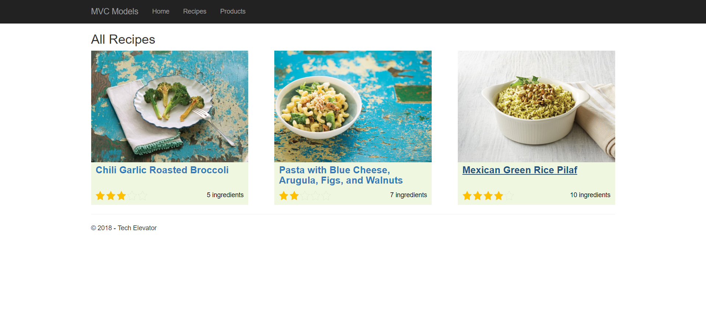
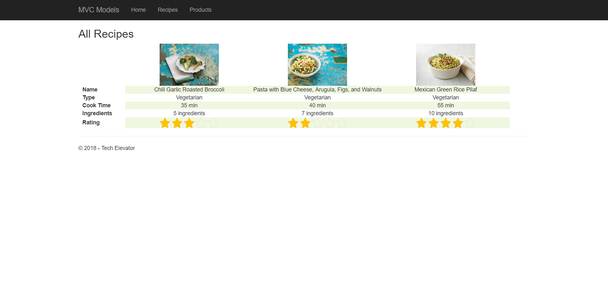
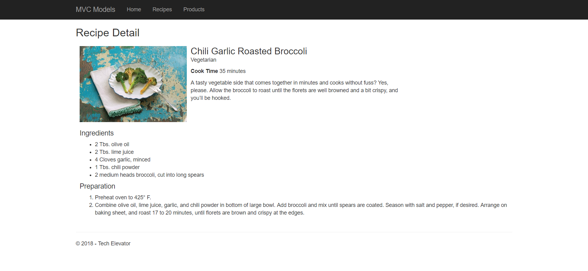

# Recipes Exercise

In this exercise you'll be creating 3 different views that work with a `Recipe` model object. For each of these a controller has already been created (the Recipes controller). Your job is to develop the 3 different views. Please note the examples attached for you to reference when developing a final layout.

1. A tile view of the recipes
    - `http://localhost:xxxxx/recipes/`
    - `http://localhost:xxxxx/recipes/index`

1. A table view of recipes to compare the data
    - `http://localhost:xxxxx/recipes/table`

1. A view of a single recipe to see it in further detail
    - `http://localhost:xxxxx/recipes/detail/1`
    - `http://localhost:xxxxx/recipes/detail?id=1`
        

For the views that display list of recipes, create a hyperlink (with the recipe name and the image) that navigates the user to the associated recipe detail page.

## Scoring Guidelines

A **2** is achieved by displaying all of the proper data on the page.

A **3** is achieved by displaying the proper data with the layout that resembles the sample UI.

If you feel that you need additional assistance with HTML & CSS, please let us know so that we can offer additional practice and direction.

## Example Layouts

### Tile View

### Table View

### Detail View

